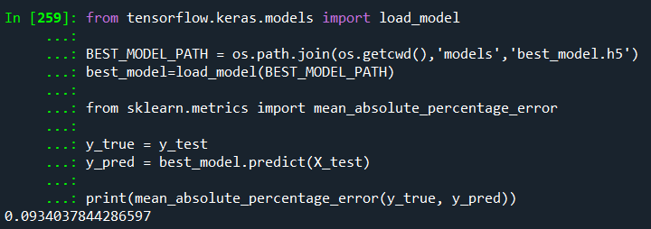

# Prediction of New Daily COVID-19 Cases in Malaysia

This Deep Learning Time Series model is an assigment project to predict the new daily COVID-19 cases in Malaysia.

## Table of Contents
* [General Info](#general-information)
* [Technologies](#technologies)
* [Installation](#installation)
* [Model Development](#model-development)
* [Credits and Acknowledgments](#credits-and-acknowledgements)
* [Contact](#contact)

## General Information

This Deep Learning Time Series model is able to predict the new daily COVID-19 cases in Malaysia based on the past 30 days number of cases. It will help scientists and policy makers alike in making the best decision to curb the wide spread of the virus such as travel ban.

The year 2020 was a catastrophic year for humanity. Pneumonia of unknown aetiology was first reported in December 2019., since then, COVID-19 spread to the whole world and became a global pandemic. More than 200 countries were affected due to pandemic and many countries were trying to save precious lives of their people by imposing travel restrictions, quarantines, social distances, event postponements and lockdowns to prevent the spread of the virus. However, due to lackadaisical attitude, efforts attempted by the governments were jeopardised, thus, predisposing to the wide spread of virus and lost of lives.

## Technologies

- Python 
    - Spyder (Python 3.8.13) 
    - Google Colab (Python 3.6) 
        - Pandas 1.4.3 
        - Numpy 1.22.3 
        - Matplotlib 3.5.1 
        - Scikit Learn 1.0.2 
        - Tensorflow 2.3.0 
 
## Installation

1) Go to [Google Colab](https://colab.research.google.com/) and sign in with your Google account
2) Download the models folder from the repository and upload it in Google Colab
3) Run the model

## Model Development

- This dataset is a Time Series problem, thus a Deep Learning Long Short Term Memory (LTSM) algorithm was used.
- The following is the architecture of the LTSM model of 4 layers that was used:

From the algorithm above, the model was able to produce prediction with Mean Absolute Percetage Error (MAPE) of 9.34%.

Below is the computed MAPE score:

Using Tensorboard, the model training was visualized as follows:

From the visual above, we can see that the model's training loss decreased significantly around 20th epoch and stabilize around 40th epoch, before it fluctuated again from 110th epoch above. Using Model Checkpoint callback in the training of the model helped us to identify the best model within all the epoch iterations.

Finally, we visualized the predicted new daily COVID-19 cases and the actual daily COVID-19 cases below:

From the graph above, the model was able to predict very closely in the first 70 days, before it lags from there on when the new daily cases suddenly burst. However, we can observe that the model was still able to predict the trend of the new daily cases, which is still useful in giving insights to the scientists and policy makers.

## Project Status

Project is completed for the assignment.

## Credits and Acknowledgements

This data was sourced from [Ministry of Health Malaysia | GitHub](https://github.com/MoH-Malaysia/covid19-public).

Special thanks to Alex Koh and Warren Loo from SHRDC and Dr Mohammed Al-Obaydee from HRD Academy for the guidance and training to make 
this project possible.

## Contact

Created by [@Muhammad Al Mubarak Zainal Abeeden](https://www.linkedin.com/in/m-almubarak-za/) - Any suggestions or feedbacks are welcomed. Feel free to contact me!
